# fire_fishman

## Quantifying Systemic Failures in Yankees Analytics (2017-2024)
**Prospect Development, Lineup Construction, and an Original Composite Metric for Intangible Contributions**

Michael Fishman has run the Yankees' analytics department since 2005. Under his leadership, the Yankees have made a series of analytically-driven decisions that were demonstrably wrong — not just in hindsight, but provably wrong with data that was available at the time.

This project uses **3M+ pitches of Statcast data (2021-2026)**, **FanGraphs team and player statistics (2017-2025)**, **MiLB development records**, and **Bayesian regression (PyMC/Bambi)** to quantify the damage across nine analyses:

1. **Prospect Development** — Elite minor league hitters systematically collapsed at the MLB level because the pipeline didn't prepare them for MLB pitch recognition
2. **Lineup Construction** — RH-heavy lineups at the most LHH-friendly park in baseball, because "RH hitters can just go oppo to the short porch"
3. **Baserunning Philosophy** — Abandoned stolen bases and baserunning fundamentals, going from 7th in BsR to dead last while becoming the most HR-dependent team in baseball
4. **Defensive Neglect** — 2nd worst OAA in baseball (2018-2021), costing 7.0 wins, then jumped to #1 DRS in 2022 proving the talent was always available
5. **The Dawg Metric** — An original composite metric (pressure + hustle + grit) that predicts team WAR (r = +0.30) independently of offensive talent, validated via Bayesian regression and 10-fold CV with playoff prediction improvement from 82% to 86%
6. **The Extremes Trap** — Oscillating between all-or-nothing sluggers (Gallo: 18.5% barrel rate, 40% K) and contactless slap hitters (IKF: 1.2% barrel rate, .650 OPS) while contenders built complete hitters
7. **The Counter-Example** — Ben Rice proves the system was broken, not the talent: his discipline held (21% chase rate vs 31% for Volpe/Dominguez), validating the readiness gate framework
8. **Roster Construction** — Profiling the archetypes contenders actually build (complete hitters, speed/defense specialists, platoon bats, table-setters) vs the Yankees' extreme-only approach
9. **The Ideal 1-9 Lineup** — Data-driven lineup position model with role-specific fit scores, optimal assignment via Hungarian algorithm, and a live 2025 Yankees application showing gaps vs the ideal

---

## Case Study 1: The Prospect Pipeline Is Broken

Anthony Volpe and Jasson Dominguez were the Yankees' two highest-profile prospects in a generation. Both had elite physical tools. Both had strong minor league track records. Both collapsed at the MLB level.

### The discipline was real — MLB broke it

Both prospects had elite plate discipline in the minors. FanGraphs data confirms it: Volpe posted a 15.2% BB rate and sub-20% K rate across A/A+ in 2021 (.449 wOBA, 171 wRC+). Dominguez walked at a 15.3% clip in AA/AAA in 2023. These are star-caliber numbers.

Against MLB pitching, both collapsed:

| Metric | Volpe MiLB | Volpe MLB | Dominguez MiLB | Dominguez MLB |
|--------|-----------|-----------|----------------|---------------|
| Chase rate | 15.0% | 30.6% | 17.8% | 31.1% |
| Chase rate (breaking) | 16.7% | 33.0% | 27.3% | 41.3% |
| Chase rate (offspeed) | 29.4% | 39.2% | 20.0% | 39.5% |

The issue isn't talent — it's **calibration**. Their pitch recognition was trained on minor league stuff. MLB breaking balls break later, tunnel better, and are sequenced by data-driven staffs. The Yankees let their prospects calibrate on the job instead of pre-training them.

Compare to Henderson: 30.9% K rate in A-ball dropped to 23.1% in AA with a 19.7% BB rate. He solved pitch recognition *before* his call-up. Volpe's K% flatlined at ~20% — the traditional stats looked great while hiding the pitch recognition ceiling.

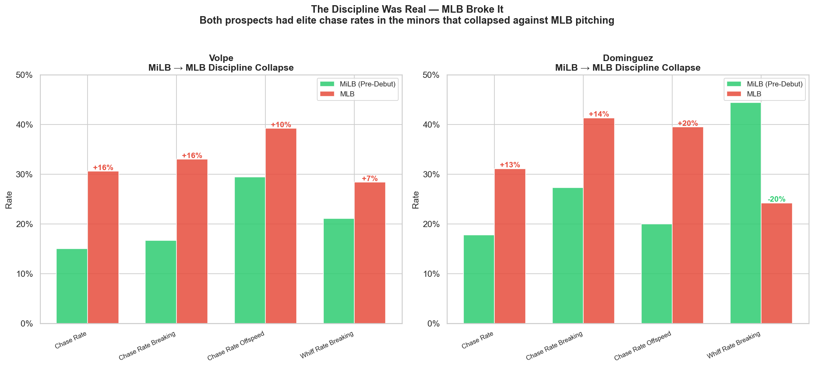

### What separates stars from busts (n=19)

| Metric | Stars | Busts | Effect Size |
|--------|-------|-------|-------------|
| Chase rate on offspeed | 38.2% | 42.1% | d = -0.75 |
| Whiff rate vs 96+ mph | 18.6% | 23.8% | d = -0.67 |
| Chase rate on breaking balls | 33.2% | 36.0% | d = -0.64 |

Overall whiff rate (d = -0.08) and zone contact rate (d = -0.02) show almost no separation. **The aggregate metrics hide the signal.**

### It's the system, not the players

This isn't two isolated cases. The Yankees system repeatedly produced hitters who won minor league discipline awards and then collapsed:

| Player | MiLB Discipline | MLB Result |
|--------|----------------|------------|
| **Volpe** | "Best Strike-Zone Discipline" (BA), .423 OBP | Chase rate doubled, seasonal collapse pattern |
| **Dominguez** | "Best Strike-Zone Discipline" (BA), 17.3% K rate | Chase rate doubled, breaking ball chase 41% |
| **Peraza** | Solid AAA numbers | 35% breaking ball chase, couldn't stick |
| **Rice** | 13.3% BB rate, Yankees MiLB POTY | **Chase rate held at 21%**, xwOBA .394 in 2025 breakout |

Rice is the counter-example that makes the failures more damning. Same system, same park — but his discipline survived the jump. Meanwhile, the Orioles (Henderson), Diamondbacks (Carroll), Reds (De La Cruz), and Royals (Witt Jr.) consistently translate minor league discipline to the majors. See [Notebook 10](notebooks/10_rice_comparison.ipynb) for the full Rice comparison.

---

## Case Study 2: The Short Porch Disaster

Yankee Stadium's right field porch is 314 feet — one of the shortest in baseball. Left-handed pull hitters are the natural exploiters of this dimension. Under Fishman, the Yankees insisted right-handed hitters could just go opposite field to take advantage. They built RH-heavy lineups and played home run ball — without the handedness to exploit their own park.

### LHH pull power dominates RHH oppo power at Yankee Stadium

At Yankee Stadium (2023-2024 Statcast):

| Metric | LHH Pull | RHH Oppo |
|--------|----------|----------|
| HRs to right field | **153** | 108 |
| HR rate to RF per PA | **6.03%** | 2.71% |
| Avg exit velocity | 103.7 mph | 101.9 mph |
| Avg distance | 387 ft | 370 ft |

**LHH are 2.2x more productive per PA to the short porch.** RHH oppo HRs are lower-exit-velo, shorter-distance, and less repeatable. Pull power is a skill; oppo power is a fluke.

### Pitchers loved the all-RH lineup

When 7 right-handed hitters are in the lineup 1-9, pitchers only need one gameplan. No adjustment between LHH and RHH sequencing, no flipping pitch tunnels, no changing release angle approaches. Lineup diversity is a competitive advantage the Yankees gave away for free.

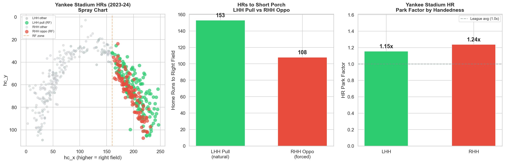

---

## Case Study 3: The Baserunning Disaster

Under Boone and Fishman's analytics, the Yankees abandoned baserunning as a competitive tool. They didn't steal, didn't take extra bases, and made terrible decisions on the bases.

### BsR collapse: 7th to dead last

| Year | BsR | Rank | SB | UBR | wSB |
|------|-----|------|----|-----|-----|
| 2017 | +7.6 | 7th | 90 | +0.7 | +4.7 |
| 2018 | +1.9 | 13th | 63 | +9.7 | +0.4 |
| 2019 | -2.1 | 16th | 55 | +0.2 | -1.8 |
| 2020 | -0.2 | 15th | 27 | +6.9 | +0.6 |
| 2021 | -3.9 | 20th | 63 | -3.7 | +0.0 |
| 2022 | -6.2 | 24th | 102 | -8.7 | +1.2 |
| 2023 | -11.5 | 29th | 100 | -8.5 | -3.0 |
| 2024 | -17.2 | **30th** | 88 | -10.9 | -5.2 |

**Total BsR (2018-2024): -39.2 runs = 3.9 wins lost** to bad baserunning alone.

### Not just slow — fundamentally bad

The UBR (extra base taking) collapse is worse than the stolen base issue. UBR went from +9.7 (2018) to -10.9 (2024). This captures getting thrown out on the bases, failing to advance on balls in dirt, missing first-to-third opportunities. This isn't "we don't have fast guys" — this is a team that can't run the bases under any circumstances.

### HR or nothing

The Yankees were the **#1 most HR-dependent team** in 2018, 2022, and 2023. When you don't steal, don't take extra bases, and don't have lefty power to exploit your own park, you're left waiting for a home run. When they don't come — postseason, good pitching — there's no Plan B.

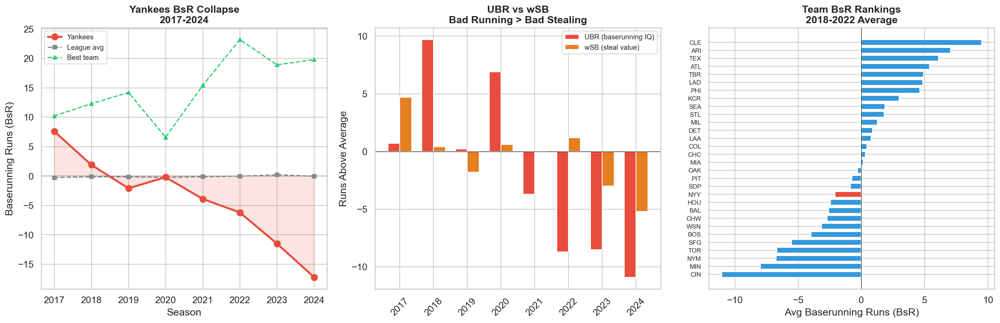

---

## Case Study 4: The Defensive Disaster

The same analytics department that ignored baserunning and lineup construction also neglected defense. From 2018-2021, the Yankees had the **2nd worst OAA in baseball** — worse than tanking teams.

| Year | DRS | OAA | Def | DRS Rank |
|------|-----|-----|-----|----------|
| 2017 | +29 | +19 | +19.1 | 12th |
| 2018 | +36 | **-36** | -10.6 | 9th |
| 2019 | -14 | **-38** | -28.0 | 20th |
| 2020 | -1 | -9 | -5.4 | 21st |
| 2021 | -41 | -22 | -26.3 | 27th |
| 2022 | **+124** | +21 | +57.7 | **1st** |
| 2023 | +29 | +2 | +16.9 | 10th |
| 2024 | +31 | +10 | +35.3 | 12th |

**Total Def (2018-2021): -70.3 runs = 7.0 wins lost.** Then 2022 happened and they jumped to #1 in DRS. The talent to play defense was always available — they just chose not to prioritize it for 4 years.

### The October problem: no dawg, no Plan B

The teams that beat the Yankees in October all excelled at exactly what Fishman's analytics ignored:

- **2018**: Red Sox (Def +38.6) beat Yankees (Def -10.6) in ALDS
- **2019**: Astros (Def +34.8) beat Yankees (Def -28.0) in ALCS
- **2022**: Astros swept Yankees in ALCS despite NYY having better Def (+57.7 vs +35.2) and Dawg (#3 vs #15) — but the Yankees' Hustle was -0.98. They couldn't manufacture runs when Houston's pitching shut down the long ball.
- **2024**: Dodgers (Dawg #3) beat Yankees (Dawg #25) in WS 4-1

You can't out-homer elite pitchers for 7 games. When the HRs stop, you need other ways to win — speed, defense, lineup diversity, clutch hitting. Even in 2022, the Yankees' best Dawg year, the missing Hustle component was the difference. Only Stanton consistently shows up in October.

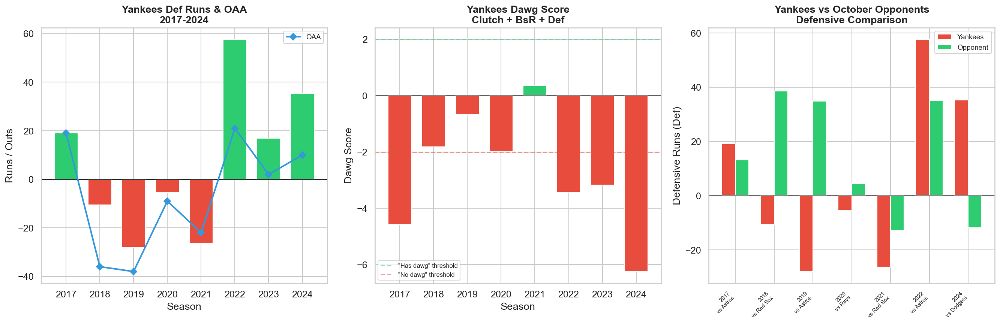

### The 2022 paradox: why 99 wins still got swept

The 2022 Yankees are the obvious counterargument — they fixed defense (#1 DRS), showed up in the clutch (Pressure +1.98), and won 99 games. But they never fixed baserunning. Their Hustle component was **-0.98**, the worst of any top-10 Dawg team in the entire 2017-2024 dataset. They were also the **#1 most HR-dependent team** in baseball (31.5% of runs via HR).

The first half masked the problem: 64-28 (.696), a 117-win pace. The second half revealed it: 35-35 (.500). Then came the ALCS against Houston's elite pitching:

| Stat | Yankees | Astros |
|------|---------|--------|
| Runs per game | 1.8 | 4.5 |
| Runs via HR | ~4 | ~3 |
| Runs manufactured (non-HR) | **3** | **15** |

Houston manufactured 15 runs without the home run. The Yankees managed 3. That's what Hustle = -0.98 looks like in October: can't steal, can't take extra bases, can't advance on balls in dirt. When the HR dries up, the offense dies.

The 2022 team proved you can fix Grit (defense) overnight — just prioritize it. But Hustle (baserunning philosophy) was never addressed under Fishman. That's not a talent problem. It's an analytics philosophy problem.

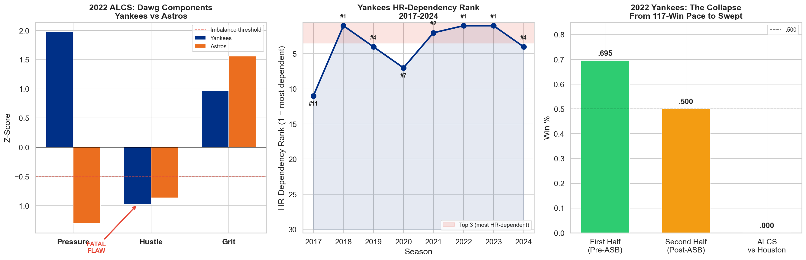

---

## Case Study 5: The Dawg Metric — Quantifying Heart

We built an original composite metric to measure what the Fishman Yankees never valued: clutch execution, baserunning aggression, and defensive effort.

### Formula

```
Dawg = 0.30 × Pressure + 0.35 × Hustle + 0.35 × Grit

Pressure = z(+WPA) + z(-WPA, flipped) / 2    — step up vs choke
Hustle   = z(UBR) + z(BsR) / 2               — extra bases, aggression
Grit     = z(OAA)                            — making plays in the field
```

All components z-scored within each season. Hustle and Grit weighted higher (35% each) because they're **controllable** — effort and philosophy, not luck.

### It's independent of talent, but predicts winning

| Test | Result |
|------|--------|
| Dawg vs wRC+ (offensive talent) | r = +0.09 (not significant) |
| Dawg vs WAR (winning) | r = +0.30 (p < 0.0001) |
| R² improvement (wRC+ alone -> +Dawg) | 59.0% -> 64.5% (+5.4pp) |
| Year-ahead: Dawg -> next year WAR | r = +0.22 (p = 0.003) |
| Playoff prediction accuracy | 82.4% -> 86.6% with Dawg components |

**+1 standard deviation of Dawg = ~4.0 additional team WAR.** This isn't captured by offense. It's the stuff that wins in October — and it's exactly what Fishman's analytics department ignored for a decade.

### Grit is the most persistent component

OAA (defensive effort) is the most year-over-year stable component (r = +0.19, p = 0.009), meaning teams that invest in defense maintain that edge. The Yankees chose not to invest for 4 years.

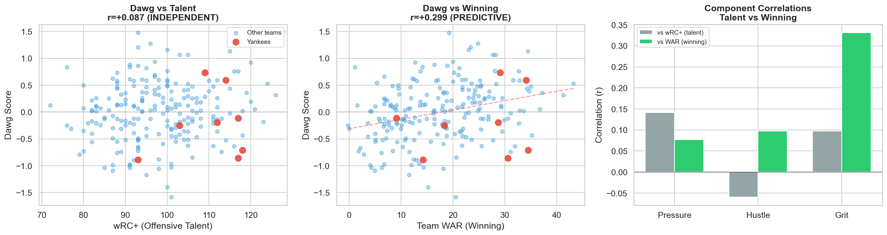
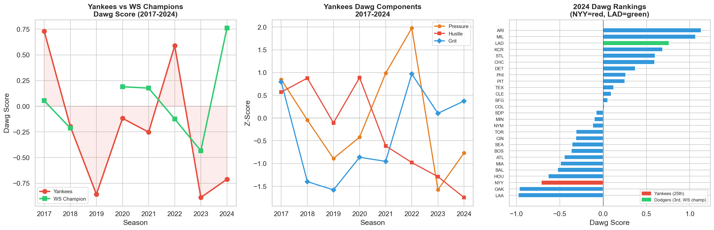

---

## Case Study 6: The Extremes Trap — Gallo, IKF, and the Complete Hitter Gap

Fishman's analytics department couldn't find the middle ground between power and contact. They acquired Joey Gallo (elite barrel rate, 40% K rate) as a bet that Yankee Stadium would unlock his pull power. When that failed, they over-corrected with Isiah Kiner-Falefa (low K%, but 1.2% barrel rate and weak grounders). Both were expressions of the same blind spot: buying **output metrics** without demanding the **process** (pitch recognition, chase rate, adaptability) that makes them sustainable.

### The extremes, side by side

| Metric | Gallo (NYY) | IKF (NYY) | Contender median |
|--------|-------------|-----------|------------------|
| K% | 37.7% | 16.1% | 20.3% |
| BB% | 15.0% | 6.6% | 9.1% |
| Barrel% | 8.1% | 1.0% | 9.3% |
| wRC+ | 84 | 84 | 117 |

Contender median = median qualified starter on HOU/LAD/ATL (2021-2023, n=97). Gallo's K% was nearly double the contender baseline. IKF's barrel rate was 1/9th of what contenders expected from a starter. Both ended up at 84 wRC+ — opposite extremes, same result.

Note: Gallo brought solid defense (positive OAA in the outfield), so he wasn't zero-value. The failure was the acquisition *thesis* — that his power profile would translate at Yankee Stadium — and the inability to course-correct without lurching to the opposite extreme.

### The balanced hitter gap

Defining a "sweet spot" hitter as K% < 25%, Barrel% > 6%, BB% > 8% (can hit for power, controls the zone, walks):

| Year | Yankees | Astros | Dodgers | Braves |
|------|---------|--------|---------|--------|
| 2021 | **1** of 11 | 5 of 10 | 5 of 11 | 3 of 9 |
| 2022 | **1** of 11 | 4 of 10 | 5 of 10 | 4 of 12 |
| 2023 | **2** of 10 | 3 of 12 | 4 of 12 | 5 of 11 |

Contenders consistently had 3-5 complete hitters. The Yankees had 1-2. That's the Fishman roster construction philosophy: acquire extremes instead of building balance.

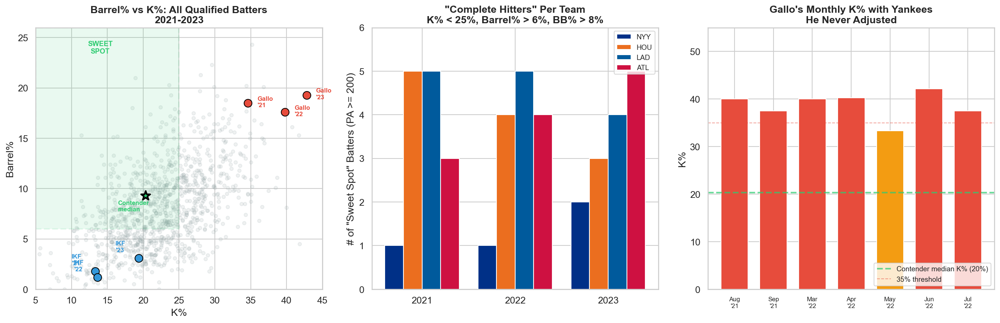

---

## Case Study 7: The Counter-Example — Ben Rice Proves the System Was Broken

If every Yankees prospect failed, you could blame scouting, the AL East, or bad luck. But Ben Rice came through the same pipeline and succeeded — which makes the other failures more damning, not less.

### The discipline held

Rice debuted in 2024 to a rough surface line: .171 AVG, .613 OPS in 50 games. But the underlying numbers told a different story:

| Metric | Rice 2024 | Rice 2025 | Volpe (career) | Dominguez (career) |
|--------|-----------|-----------|----------------|-------------------|
| Chase rate | 20.6% | 21.2% | ~31% | ~31% |
| Whiff rate | 25.8% | 21.2% | ~28% | ~30% |
| Barrel% | 15.6% | 15.4% | ~7% | ~9% |
| xwOBA | .340 | **.394** | ~.300 | ~.290 |
| BABIP | **.186** | .271 | ~.290 | ~.280 |

Rice's 2024 BABIP of .186 was absurdly low — league average is ~.300. He was getting robbed, not failing. His xwOBA of .340 on a small sample (50 games, ~180 PA) signaled the contact quality was real. In 2025, with 530 PA, it all came together: .255/.836 OPS, 26 HR, and an xwOBA of .394 that says he's even better than the numbers show.

### The short porch connection

Rice is exactly the player profile Case Study 2 said the Yankees should build around: a left-handed hitter who can use the whole field and lets Yankee Stadium's 314-foot right field porch work for him when the pitch is there. He's not one-dimensional — he goes oppo when the situation calls for it and pulls when a pitcher leaves one over the plate. That's a complete hitter, not a pull machine.

### What Rice did differently

| Dimension | Rice | Volpe/Dominguez |
|-----------|------|-----------------|
| MiLB BB% | 13-15% | 11-15% |
| MLB chase rate | **21%** (held) | **31%** (doubled) |
| Breaking ball vulnerability | Controlled | Exploited |
| BABIP adjustment | Unlucky in year 1, corrected in year 2 | Chase rate never corrected |
| Approach | Uses whole field, barrels the ball | Expanded zone under pressure |

The readiness gate framework from Notebook 05 validates this: Rice passes more gates than Volpe, Dominguez, or Peraza. His pitch recognition survived the jump to MLB-quality breaking balls. Theirs didn't. Same org, same park, different outcome — because his development actually worked.

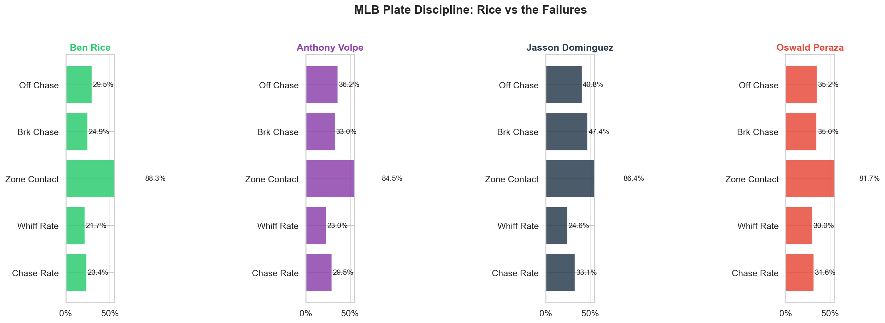

---

## Case Study 8: Roster Construction — Build Complete, Not Extreme

The Gallo/IKF problem from Case Study 6 wasn't just about two bad acquisitions. It was a philosophy: the Yankees consistently filled roster spots with extreme archetypes instead of building a balanced lineup. Contenders don't do this.

### The roster blueprint

Every contending team carries a mix of roles:

| Role | Spots | Key Traits | What They Give Up |
|------|-------|------------|-------------------|
| **The Star** | 1-2 | Elite in everything | Nothing — they do it all |
| **The Complete Hitter** | 3-4 | Barrel + contact + walks + baserunning | Ceiling (they're .310-.350 wOBA, not .400) |
| **The Speed/Defense Specialist** | 1 | Elite defense, runs the bases, makes enough contact | Power — sub-5% barrel rate is fine if they're +15 OAA |
| **The Power Platoon** | 1 | Mashes one side, high barrel rate | Contact and playing time — sits vs same-side arms |
| **The Table-Setter** | 1 | High OBP, sees pitches, controls the zone | Power — they walk and single, not homer |

Specialists are fine — a speed+defense guy, a power platoon bat, a high-OBP table-setter. The mistake is when 3+ roster spots are filled by the same extreme. Two power bats are fine if you have speed elsewhere. Two speed guys are fine if you have power elsewhere. **Three Gallos or three IKFs = broken.**

### The Yankees' archetype gap

Defining a "complete hitter" as K% < 25%, Barrel% > 6%, BB% > 8%, wOBA > .310 — not star numbers, just baseline competence:

| Year | Yankees Complete | Dodgers Complete | Astros Complete | Yankees Extremes |
|------|----------------|-----------------|-----------------|------------------|
| 2021 | **1** | 5 | 5 | 2 slugger + 1 contact |
| 2022 | **1** | 5 | 4 | 2 slugger + 2 contact |
| 2023 | **2** | 4 | 3 | 1 slugger + 1 contact |
| 2024 | **2** | 5 | 3 | 1 slugger + 0 contact |

The Dodgers consistently carry 4-5 complete hitters. The Yankees have 1-2 and fill the rest with extremes. The problem isn't that they acquired Gallo or IKF specifically — it's that the roster construction philosophy never had room for balanced, multi-tool role players.

### The anti-extreme: what a balanced role player looks like

The ideal complementary hitter doesn't need to be elite at everything. They just need to not be one-dimensional:

- **Makes contact** (K% < 22%): Can move runners, execute with 2 strikes
- **Has some barrel** (Barrel% > 6%): Not an empty batting average
- **Takes walks** (BB% > 8%): Gets on base, works counts
- **Uses the whole field**: Not locked into one approach
- **Can run** (BsR > 0): Doesn't clog the bases

This is the profile that Rice exemplifies. It's also the profile the Dawg metric rewards — complete hitters run the bases (Hustle), produce in leverage situations because they have multiple ways to beat you (Pressure), and a lineup full of balanced hitters creates more competitive at-bats than a lineup of extremes waiting for a three-run homer.

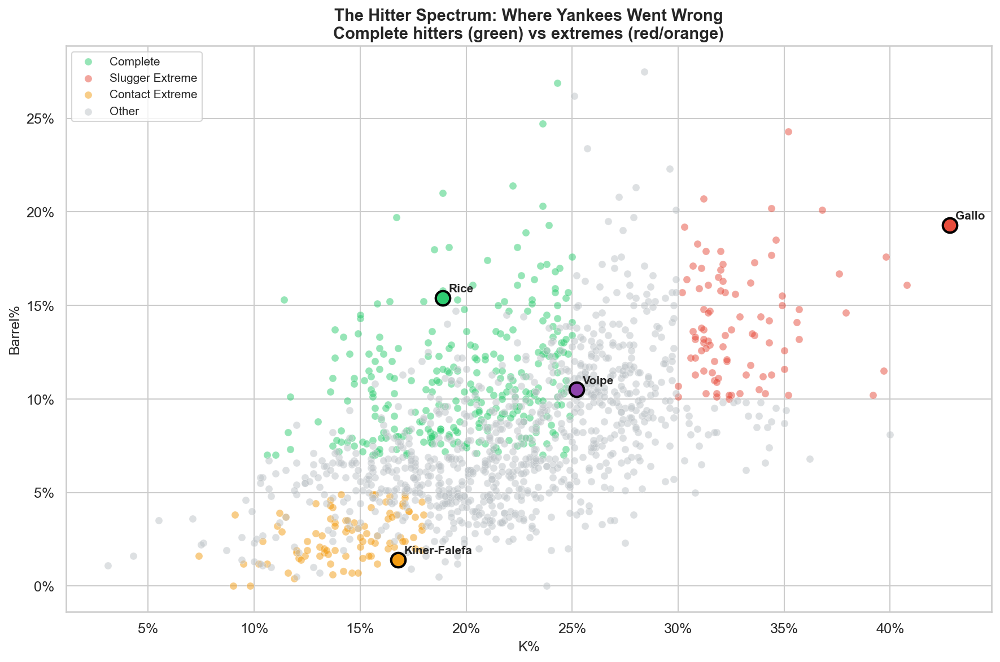

---

## Case Study 9: The Ideal 1-9 Lineup — Beyond "Sort by wOBA"

Standard sabermetric lineup construction says: put your best OBP guy first, best hitter second, sort the rest by wOBA, and don't overthink it because lineup order barely matters (~10-15 runs/season). That's true in aggregate. But the real value of a lineup model isn't finding 15 runs in the batting order — it's **diagnosing what's missing from the roster**.

### Each spot has a distinct role

We defined 9 lineup positions with role-specific profiles, weighted by the metrics that matter most for that spot:

| Spot | Role | Key Metrics | What SABR Misses |
|------|------|-------------|------------------|
| **1** | Table-Setter | OBP + speed + low K% | Speed creates run expectancy that pure OBP doesn't capture |
| **2** | Best Hitter | Highest wOBA + OBP | Agreement with SABR — your MVP bats here |
| **3** | OBP + Power | OBP >= .340, ISO >= .180 | Not a pure slugger — needs to get on base for cleanup |
| **4** | Cleanup | Max ISO, Barrel% >= 10% | Pure damage. This is where your biggest power bat goes |
| **5** | Power/Contact | ISO >= .150, K% <= 25% | Contact matters — can't strand runners with K's |
| **6** | Handedness Break | Solid all-around, opposite hand from 5 | Forces bullpen decisions. SABR ignores handedness alternation |
| **7** | Contact Manufacturer | K% <= 20%, AVG >= .260 | Moves runners, puts ball in play. Manufacturing in the bottom third |
| **8** | Specialist | Defense-first, BsR > 0 | Speed to score from 1st on doubles. Lowest offensive floor |
| **9** | Second Leadoff | OBP >= .320, BB% >= 9% | Turns lineup over to 1-2. SABR undervalues this spot |

### Optimal assignment, not just sorting

We use the **Hungarian algorithm** (optimal assignment) to place each player in the spot where the team's total fit is maximized. Each player gets a 0-100 fit score for every lineup position based on z-scored metrics weighted by that spot's priorities.

The result: a lineup card where every player is in the role that best matches their skill set, and a **gap analysis** showing which spots are well-filled (70+ fit score) and which are missing pieces (<50).

### The 2025 Yankees as a live example

We map the 2025 Yankees roster to the model and ask:
- Which spots have strong fits?
- Where are the gaps — and what type of player would fill them?
- How does the optimal lineup differ from a naive wOBA sort?

The gaps are the roster construction blueprint. A team with strong fit scores at all 9 spots has balanced production, distributed power, contact in the middle of the order, and speed where it matters. That's not a batting order — that's a **roster diagnosis**.

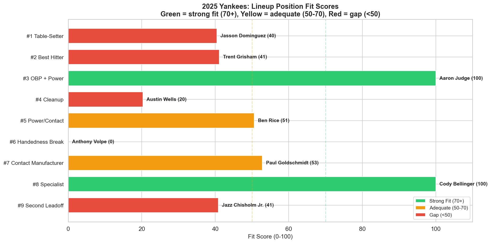

---

## The Fishman Scorecard

| Bad Take | Damage | Period |
|----------|--------|--------|
| Prospect pipeline doesn't prepare for MLB pitch recognition | Stars pass 60%+ of Statcast gates; Yankees busts pass <40% | 2019-2024 |
| RH-heavy lineup despite most LHH-friendly park in baseball | LHH 2.2x more productive to RF; ~27 HRs left on table | 2017-2022 |
| Abandoned baserunning as competitive tool | -39.2 BsR = 3.9 wins lost; 30th by 2024 | 2018-2024 |
| Neglected defense for 4 years | -70.3 Def runs = 7.0 wins lost; -105 OAA | 2018-2021 |
| #1 most HR-dependent team with no Plan B | 3 years at #1; can't win in October | 2018-2023 |
| Zero investment in "Dawg" (clutch + hustle + grit) | Dawg predicts WAR (r=+0.30) independent of talent; Yankees bottom-third | 2017-2024 |
| Acquired extremes instead of complete hitters (Gallo/IKF) | 1-2 "sweet spot" batters vs 3-5 for contenders; same blind spot as prospect pipeline | 2021-2023 |

**Estimated total damage: ~14 wins** from baserunning, defense, and lineup construction alone. That doesn't include the prospect development failures, the October collapses, or the opportunity cost of building a one-dimensional roster in the most versatile park in baseball.

The fix was always available — the 2022 team proved it, and Ben Rice proved it again in 2025. The talent was never the problem. They just had an analytics department that believed in one thing: the three-run homer. And when it doesn't come, you go home in October.

---

## Analysis Modules

| Notebook | Question |
|----------|----------|
| [01 — Translation Gap](notebooks/01_translation_gap.ipynb) | Who has elite tools but poor results? |
| [02 — Pitch Diagnostics](notebooks/02_pitch_diagnostics.ipynb) | Where exactly do Volpe/Dominguez break down? |
| [03 — Effect Sizes](notebooks/03_prediction_model.ipynb) | Which metrics most separate stars from busts? |
| [04 — Prescriptions](notebooks/04_prescriptions.ipynb) | What specific changes would improve their outlook? |
| [05 — Prevention](notebooks/05_prevention_analysis.ipynb) | Monthly trends, pitch mix exploitation, readiness gates |
| [06 — MiLB vs MLB](notebooks/06_milb_vs_mlb.ipynb) | The discipline was real — MLB broke it |
| [07 — Systemic Analysis](notebooks/07_yankees_systemic.ipynb) | Why this keeps happening to the Yankees |
| [08 — Fishman's Bad Takes](notebooks/08_fishman_case_studies.ipynb) | Short porch, baserunning, defense, dawg metric, 2022 paradox, extremes trap |
| [09 — Dawg Metric Deep Dive](notebooks/09_dawg_metric.ipynb) | Independence test, regression, year-ahead prediction, playoff model |
| [10 — Rice: The Counter-Example](notebooks/10_rice_comparison.ipynb) | Ben Rice vs Volpe/Dominguez/Peraza — what success looks like |
| [11 — Ideal Role Player Profile](notebooks/11_role_player_profile.ipynb) | The anti-Gallo/anti-IKF: what complementary hitters should look like |
| [12 — The Ideal 1-9 Lineup](notebooks/12_ideal_lineup.ipynb) | Data-driven lineup position model: optimal assignment of 2025 Yankees using Hungarian algorithm |

## Data

All data sourced from public [Statcast](https://baseballsavant.mlb.com) via [pybaseball](https://github.com/jldbc/pybaseball) and [FanGraphs API](https://fangraphs.com).

| Dataset | Volume | Coverage | Use |
|---------|--------|----------|-----|
| Statcast pitch-level | **3M+ pitches** | 2021-2026 | Plate discipline, whiff rates, exit velo, batted ball direction |
| FanGraphs team batting | **240 team-seasons** | 2017-2024 | BsR, UBR, wSB, lineup handedness, HR dependency |
| FanGraphs team fielding | **240 team-seasons** | 2017-2024 | OAA, DRS, UZR, Def |
| FanGraphs player batting | **2,500+ player-seasons** | 2021-2025 | Barrel%, K%, BB%, wOBA, wRC+, hitter archetype classification |
| Dawg metric regression | **216 team-seasons** | 2017-2024 | Bayesian regression, 10-fold CV, playoff prediction |
| Prospect profiles | **20 prospects** | 2019-2026 debuts | Tools scores, translation gaps, readiness gates |
| MiLB stats | **10 prospect careers** | 2021-2024 | BB%, K%, wOBA, wRC+ by level for pre-/post-debut comparison |
| Pre-debut Statcast | **343 pitches** | Spring Training / MiLB | Pitch recognition calibration baseline |

## Setup

```bash
git clone https://github.com/regimeiq/fire_fishman.git
cd fire_fishman
pip install -e .

# Pull data (~5 min per season, cached as parquet after first run)
python -c "
from fire_fishman.data.statcast import get_statcast_pitches, get_batting_stats
for year in range(2021, 2027):
    get_statcast_pitches(year)
    get_batting_stats(year)
"

jupyter notebook notebooks/
```

## Methods

| Method | Application | Why |
|--------|-------------|-----|
| **Bayesian regression** (PyMC/Bambi) | Dawg metric → WAR relationship | Uncertainty quantification on small-ish team-season samples |
| **Effect size analysis** (Cohen's d) | Star vs bust separation on n=20 prospects | More honest than ML classifiers at small n |
| **10-fold cross-validation** | Dawg playoff prediction model | Standard validation; KFold with shuffle for team-season data |
| **Z-scoring within season** | All Dawg components, tools scores | Controls for year-over-year league-wide shifts |
| **XGBoost** (sanity check) | Feature importance for prospect translation | LOO-CV, used to confirm effect size rankings |
| **Statcast-based readiness gates** | Prospect call-up framework | Pitch-type-specific thresholds derived from star 75th percentiles |
| **Hitter archetype classification** | Roster construction analysis | Multi-dimensional profiling (barrel%, K%, BB%, BsR) |
| **Hungarian algorithm** | Optimal lineup assignment | Maximize total fit score across 9 lineup positions with distinct role profiles |

## Limitations

- **MiLB sample is small** (89-254 pitches from Spring Training). Directionally strong but not definitive.
- **Prospect cohort is n=20**. Effect sizes are more honest than ML classifiers at this sample size.
- **Handedness analysis uses 2023-2024 Statcast** — the RH-heavy era (2017-2022) was worse but we don't have full pitch-level data for those years.
- **Baserunning estimates are conservative** — BsR captures runs above average, not the full opportunity cost of the philosophy.
- **Rice's 2024 MLB sample is small** (~180 PA, 50 games). The 2025 full season (530 PA) is the meaningful data point.

## Tech Stack

| | |
|---|---|
| **Core** | Python 3.11+, pandas 2.0+, NumPy |
| **Data** | pybaseball (Statcast + FanGraphs API), parquet caching |
| **Statistical modeling** | PyMC, Bambi, ArviZ (Bayesian), scikit-learn, XGBoost |
| **Visualization** | matplotlib, seaborn |
| **Infrastructure** | Jupyter notebooks, pip-installable package (`src/fire_fishman/`), git |
