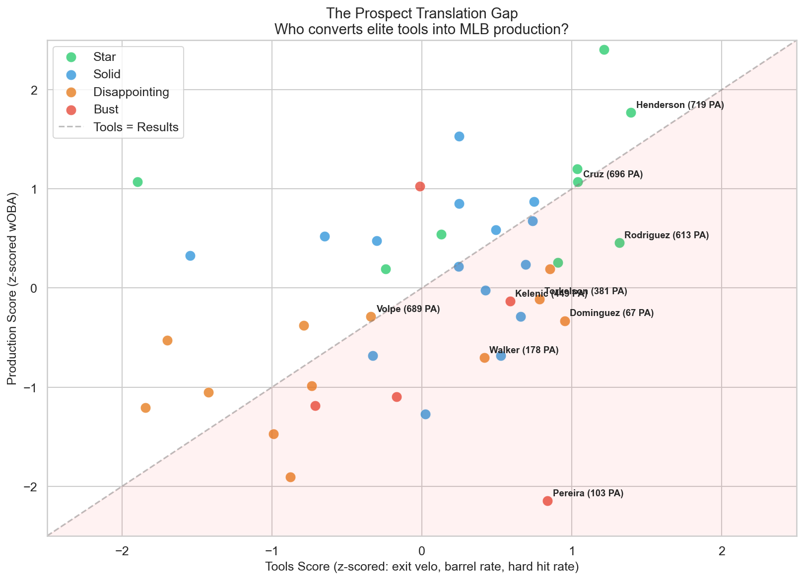
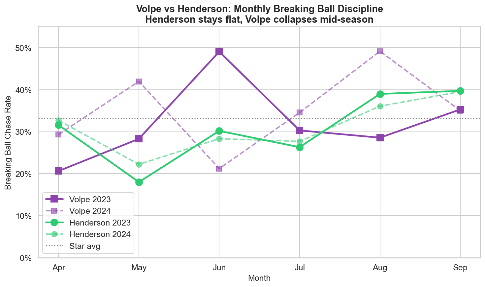

# fire_fishman 🐟🔥

## Why Do Elite MLB Prospects Fail?

Top prospects like Anthony Volpe and Jasson Dominguez arrive with elite physical tools — bat speed, exit velocity, barrel rate — yet struggle at the MLB level. The scouting grades are there. The Statcast numbers say the raw ability is real. So why don't the results follow?

This project models the **tools-to-production translation gap** using 1.5M pitches of Statcast data across 19 recent top-100 prospects (2019-2024 debuts). We diagnose exactly where elite prospects break down against MLB pitching and produce actionable development prescriptions.

## Key Findings

### The three metrics that most separate stars from busts:

| Metric | Stars | Busts | Effect Size |
|--------|-------|-------|-------------|
| **Whiff rate vs 96+ mph** | 18.6% | 23.8% | d = -0.67 (medium) |
| **Chase rate on breaking balls** | 33.2% | 36.0% | d = -0.64 (medium) |
| **Chase rate on offspeed** | 38.2% | 42.1% | d = -0.75 (medium) |

It's not overall whiff rate or zone contact that separates outcomes — it's **pitch-type-specific discipline**, especially against elite velocity and breaking stuff outside the zone.

### Volpe vs. Dominguez: Different Problems

**Anthony Volpe** is actually close to star benchmarks on most metrics. His biggest gap is **whiff rate against 96+ mph fastballs** (22.3% vs 18.6% star avg). His plate discipline is fine — he just can't catch up to elite velo. Closest successful comp: **Gunnar Henderson**.

**Jasson Dominguez** has a more fundamental issue: **chase rate on breaking balls** (41.3% vs 33.2% star avg) and **whiff rate vs 96+** (25.0% vs 18.6%). He's swinging at breaking stuff out of the zone at a rate 8 percentage points above the star average. Closest successful comp: **Corbin Carroll**.

### The Translation Gap



Jasson Dominguez has the **largest translation gap** in the cohort — elite tools (90.6 mph avg exit velo, top-third hard-hit rate) but a wOBA of just .285. Julio Rodriguez is the second-largest gap, showing that even stars can have tools exceeding results in a down year.

## Analysis Modules

| Notebook | Question | Method |
|----------|----------|--------|
| [01 — Translation Gap](notebooks/01_translation_gap.ipynb) | Who converts tools into production? | Tools composite z-score vs. wOBA z-score |
| [02 — Pitch Diagnostics](notebooks/02_pitch_diagnostics.ipynb) | Where do Volpe/Dominguez break? | Chase rate, whiff splits by pitch type, velocity tier, count |
| [03 — Prediction Model](notebooks/03_prediction_model.ipynb) | Which metrics predict success? | Effect size analysis (Cohen's d) across prospect outcomes |
| [04 — Prescriptions](notebooks/04_prescriptions.ipynb) | What should they work on? | Gap-to-benchmark analysis, nearest-neighbor comps |
| [05 — Prevention](notebooks/05_prevention_analysis.ipynb) | How could the Yankees have prevented this? | Monthly trend analysis, pitch mix exploitation, readiness gates |

## Development Prescriptions

### Anthony Volpe
1. **Reduce whiff rate vs 96+ mph**: 22.3% → 18.6% (timing adjustment against elite fastballs)
2. **Reduce whiff rate on fastballs overall**: 19.1% → 17.3%
3. Comp: Henderson, Witt Jr. — both handle elite velo better despite similar overall profiles

### Jasson Dominguez
1. **Reduce chase rate on breaking balls**: 41.3% → 33.2% (biggest single gap in the cohort)
2. **Reduce whiff rate vs 96+ mph**: 25.0% → 18.6%
3. Comp: Carroll, Jung — similar tools, better breaking ball discipline

## Data

All data sourced from public [Statcast](https://baseballsavant.mlb.com) via [pybaseball](https://github.com/jldbc/pybaseball) and [FanGraphs](https://fangraphs.com). No proprietary data.

- **1,503,994 pitches** (2023-2024 MLB seasons)
- **1,068 player-seasons** of batting stats
- **19 prospect profiles** with complete Statcast data (4 dropped due to insufficient MLB PA)

## Setup

```bash
git clone https://github.com/regimeiq/fire_fishman.git
cd fire_fishman
pip install -e .

# Pull data (~5 min per season on first run, then cached as parquet)
python -c "from fire_fishman.data.statcast import get_statcast_pitches; get_statcast_pitches(2023); get_statcast_pitches(2024)"

# Run notebooks
jupyter notebook notebooks/
```

## Tech Stack

- **pybaseball** — Statcast + FanGraphs data
- **pandas** — data wrangling
- **scikit-learn + XGBoost** — feature importance analysis
- **matplotlib + seaborn** — visualization
- **Cohen's d effect sizes** — statistical comparison (honest about small sample)

## How the Yankees Could Have Prevented This

**Volpe's repeating collapse:** His breaking ball chase rate starts at ~20% each April and spikes to 42-49% by mid-season — in both 2023 and 2024. Henderson (his closest comp) stays flat all year. A rolling monitoring dashboard would have flagged this within weeks.

**Dominguez is already exploited:** He sees 18.8% offspeed pitches vs. 13.0% league average. The scouting report is in after just ~400 PA. The Yankees needed to stress-test this vulnerability in AAA before promotion.

**Proposed framework:** Statcast-based promotion gates (chase rate on breaking < 35%, whiff rate vs 95+ < 22%) instead of traditional slash lines, plus real-time in-season monitoring with alert thresholds. See [Notebook 05](notebooks/05_prevention_analysis.ipynb) for the full analysis.



## Limitations & Future Work

- **Small sample (n=19)**: Not enough for robust ML — we use effect sizes and direct comparisons instead of pretending a classifier works here. Bayesian modeling with informative priors is the natural next step as more prospects debut.
- **No MiLB Statcast**: Minor league Statcast data would allow pre-debut prediction. Currently only analyzing post-call-up data.
- **Temporal dynamics**: We aggregate across seasons. Tracking metric changes *within* a prospect's first year could identify who's adjusting vs. who's stuck.

## Why This Matters

The difference between a prospect who converts and one who doesn't is worth tens of millions in roster decisions, trade value, and development investment. Physical tools are necessary but not sufficient — the translation gap is driven by pitch-type-specific adaptability, and that's coachable.
